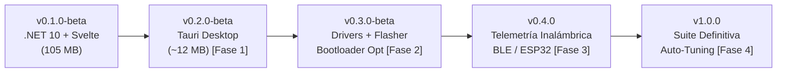

# 🏎️ Roadmap del Proyecto: Seguidor de Línea Pro

Bienvenido al Roadmap oficial de **Seguidor de Línea Pro**. Este documento define la visión técnica, los hitos de desarrollo, la arquitectura de software y firmware, y los objetivos estratégicos para convertir esta suite en el estándar de instrumentación y calibración para robots seguidores de línea de alta competencia (16 canales multiplexados y 8 canales directos).

---

## 🧭 Visión del Ecosistema

El ecosistema integra tres capas interconectadas:
1. **Firmware de Alta Precisión (C++ / Arduino Nano):** Bucle de control a 1 kHz, PWM ultrasónico sin silbidos a 31.37 kHz (Timer 2), lectura optimizada de sensores analógicos por interrupción/prescaler 16, y protocolo de telemetría determinista `$TEL`, `$PID`, `$CMD`, `$EEPROM`.
2. **Suite de Control de Escritorio (Tauri + Rust + Svelte):** Interfaz gráfica de grado industrial ("Luxury Precision Instrument"), visualización de sensores en vivo, simulación Hardware-in-the-Loop (HIL) para calibración estática, y persistencia relacional SQLite de perfiles y flotas de autos.
3. **Distribución Portable y Zero-Config:** Ejecutable autónomo sin instaladores invasivos, ligero (<15 MB), con utilidades de instalación de drivers USB y flasheo de bootloaders incorporadas.

---

## 🗺️ Fases del Roadmap

---

### 🟢 Estado Actual: Versión 0.1.0-beta (Completada)

- **Firmware Dual PlatformIO:**
  - `[env:nano_im16]`: 16 canales analógicos multiplexados vía CD4051 / 74HC4051 (pines `A0..A5`), rango 0–15000, punto de ajuste 7500, frenos dinámicos en curvas y detección de bifurcaciones en S0/S15.
  - `[env:nano_codex8]`: 8 canales analógicos directos sin multiplexor (pines `A0..A7`), rango 0–7000, punto de ajuste 3500, prescaler ADC a 16 (~128 µs de muestreo total), detección de bifurcaciones en S0/S7.
  - Pinout común optimizado: Motor Derecho (3, 4, 5), Motor Izquierdo (11, 10, 9), pulsador de calibración en D2, LED de estado en D13 con verificación física de escritura en memoria EEPROM.
- **Frontend Svelte con Estética Luxury Precision:**
  - Selector de temas Oscuro / Claro con contraste WCAG AAA impecable (eliminación de textos cian sobre cian y verde sobre verde).
  - Visualizadores de barra de 16 y 8 sensores con indicador de centro de masa y sub-sensores calculados.
  - Motor de Simulación Hardware-in-the-Loop (`🔴 Hardware en Vivo` con lectura real por WebSocket de sensores mientras el auto se mueve con la mano y motores detenidos; `💻 Pista Virtual`).
  - Sincronización bidireccional EEPROM (`🔍 Leer EEPROM` carga los parámetros físicos directamente en los sliders) y gestión de flotas con nombres personalizados por carro.
- **Backend .NET 10 Portable:**
  - Servidor Kestrel embebido con SQLite y WebSockets en `release_portable_v0.1.0-beta/LineFollowerPro.exe` (105 MB).

---

### 🚀 Fase 1: Migración a Tauri Desktop (v0.2.0-beta — COMPLETADA)

*Objetivo: Convertir la aplicación en un software de escritorio nativo Windows, reduciendo el peso de 105 MB a ~10.2 MB sin perder ninguna funcionalidad ni cambiar el diseño.*

- [x] **Módulo `src-tauri` en Rust:**
  - Inicializar Tauri v2 vinculado a los Microsoft C++ Build Tools ya presentes en el sistema.
  - Compilar contra la librería nativa de Windows `WebView2Loader.dll` (cero runtime de Node ni .NET requerido en la PC del usuario).
- [x] **Motor Serial de Ultrabaja Latencia en Rust:**
  - Reemplazar `System.IO.Ports` por el crate `serialport` de Rust.
  - Hilo de lectura dedicado con sincronización y emisión de eventos `telemetry` directamente a la ventana de la aplicación a 60 Hz.
  - Soporte robusto de tramas `$TEL`, `$PID`, `$CMD`, `$EEPROM,SAVE`, `$EEPROM,READ`.
- [x] **Persistencia SQLite Nativa (`rusqlite`):**
  - Mantener exactamente la base de datos `follower.db` y las columnas relacionales existentes (`id`, `name`, `car_name`, `car_category`, `kp`, `kd`, `base_speed`, `max_speed`, `brake_speed`, `fork_mode`, `line_color`, `created_at`).
  - Compatibilidad 100% con los perfiles existentes sin necesidad de migración manual.
- [x] **Adaptador Híbrido en Frontend:**
  - Integrar `@tauri-apps/api` manteniendo compatibilidad tanto en modo nativo Tauri como en modo navegador web de desarrollo Vite.
- [x] **Empaquetado y Verificación:**
  - Generación del ejecutable `LineFollowerPro.exe` de 10.23 MB y validación de arranque inmediato y bajo consumo de memoria RAM.

---

### 🛠️ Fase 2: Hardware Flasher, Pinout & Drivers Suite (v0.2.0-beta — COMPLETADA)

*Objetivo: Resolver el problema más frecuente en computadoras de competencia: falta de drivers USB-Serial, fallos de subida de código por bootloader incorrecto y dudas en el cableado.*

- [x] **Panel Lateral Deslizante (*HardwareDrawer.svelte*):**
  - Acceso directo no invasivo desde el botón `🛠️ Hardware & Flasher` en la barra superior.
- [x] **Centro de Instalación de Drivers USB en la UI:**
  - Botones de lanzamiento asistido para:
    - **CH340/CH341:** Para clones comunes de Arduino Nano (`CH341SER.EXE`).
    - **CP2102/CP2104:** Para tarjetas de alta calidad y ESP32 (`CP210x_Windows_Drivers.exe`).
    - **FTDI FT232R:** Para tarjetas originales o módulos externos.
- [x] **Flasheador Autónomo con Auto-Fallback de Bootloader:**
  - Selección de firmware: `16L Ingeniero Maker` (`firmware_im16.hex`) y `8L Codex` (`firmware_codex8.hex`).
  - Velocidades seleccionables: `115200` y `9600` baudios.
  - Auto-Fallback inteligente a `57600` baudios (*Old Bootloader*) en caso de timeout de sincronización STK500.
  - Integración nativa de `avrdude` y liberación previa de puerto serial.
- [x] **Esquema Interactivo de Pines & Cableado (Hardware Mapping):**
  - Diagrama visual de Arduino Nano con tabla comparativa de pines coloreados por función para 16L y 8L.
- [ ] **Soporte Futuro de Microcontroladores ESP32:**
  - Incorporar perfiles de comunicación y flasheo para ESP32-S3 y ESP32-C3 vía `esptool`.

---

### 📡 Fase 3: Telemetría Bajo Demanda, Enlace Inalámbrico y Caja Negra (v0.3.0-beta — COMPLETADA)

*Objetivo: Silencio total en el arranque para evitar sobrecalentamiento y saturación del microcontrolador, enlace transparente Bluetooth HC-05 y grabación automática de carreras.*

- [x] **Protocolo de Telemetría Bajo Demanda (Zero-Print Startup):**
  - Bandera `telemetry_active = false` en `protocol.h` al encenderse con batería. Cero interrupciones ni prints innecesarios en pista.
  - Handshake bidireccional `$CMD,STREAM_ON` y `$CMD,STREAM_OFF` automático al conectar y desconectar la suite.
- [x] **Soporte de Enlace Inalámbrico Bluetooth HC-05:**
  - Selector de velocidad serial directa (115200 y 9600 baudios) para comunicación inalámbrica transparente sin alterar la circuitería existente.
- [x] **Módulo Caja Negra (Black Box / Data Logger):**
  - Auto-grabación reactiva de carreras al detectar transiciones de estado (`STATE_READY` → `STATE_RUNNING` → `STATE_READY`).
  - Búfer de memoria de las últimas 5 vueltas con cálculo de duración exacta en ms, RMSE ($\pm \text{pts}$), velocidad pico y conteo de frenadas.
  - Gráfica interactiva de trayectoria en Canvas HTML5 a 60 FPS con superposición comparativa simultánea de Vuelta A y Vuelta B.
  - Exportación individual o en bloque a formato estándar `.csv` (compatible con Excel, Sheets, Pandas y MATLAB).

---

### 🏆 Fase 4: Auto-Calibración y Suite de Producción (v1.0.0)

*Objetivo: Versión final estable lista para distribución pública y torneos internacionales.*

- [ ] **Asistente de Auto-Sintonización PID:**
  - Algoritmo de oscilación controlada (método de relevador) para sugerir valores óptimos de $K_p$ y $K_d$ según la masa del robot y el agarre de las llantas.
- [ ] **Instalador Oficial MSI / NSIS y Auto-Actualizador:**
  - Tauri updater con firmas criptográficas para recibir mejoras y nuevos perfiles de pistas automáticamente.
