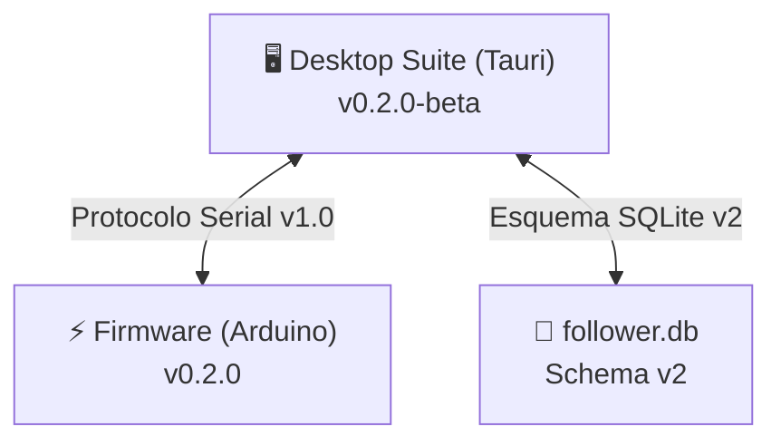

# 🏷️ Reglas de Versionamiento del Proyecto: Seguidor de Línea Pro

Este documento establece la normativa técnica y los estándares de versionamiento aplicados a todo el ecosistema de **Seguidor de Línea Pro**. 
Dado que el proyecto involucra **Firmware embebido en microcontroladores**, una **Suite de Escritorio nativa** y una **Base de Datos relacional SQLite**, se adopta una política rigurosa basada en **Semantic Versioning 2.0.0 (SemVer)** con una matriz de compatibilidad explícita entre componentes.

---

## 📌 1. Estándar Base: Semantic Versioning (SemVer 2.0.0)

El formato estándar para todas las entregas es:

$$\text{MAJOR} . \text{MINOR} . \text{PATCH} \ [- \text{PRERELEASE}]$$

Ejemplo: `0.2.0-beta`, `1.0.0`

### 1.1 Definición de Incrementos

| Componente | Cuándo incrementar | Ejemplos en este Proyecto |
| :--- | :--- | :--- |
| **MAJOR** (X.0.0) | Cambios incompatibles con versiones anteriores (*Breaking Changes*) en el protocolo serial o en la estructura de base de datos que impidan la interoperabilidad con versiones previas. | Modificación drástica del protocolo de tramas seriales `$TEL` o `$PID` que rompa la comunicación entre la app y el firmware; cambio de arquitectura incompatible. |
| **MINOR** (0.X.0) | Incorporación de nuevas funcionalidades que mantienen compatibilidad hacia atrás. | Migración de Kestrel a Tauri Desktop; adición del soporte para sensor Codex de 8 canales; modal de simulación Hardware-in-the-Loop; instalador integrado de drivers. |
| **PATCH** (0.0.X) | Corrección de errores (*bug fixes*), ajustes de diseño, refinamientos de contraste, estabilidad de conexión o ajustes menores sin alterar contratos de interfaz. | Inversión de polaridad en pines del puente H; ajuste de radios de bordes o colores de texto WCAG AAA; corrección de timeout en lectura de EEPROM. |
| **PRERELEASE** (`-beta`, `-rc.X`) | Versiones en desarrollo o pruebas previas a una versión estable definitiva. | `0.1.0-beta` (prototipo inicial .NET/Svelte), `0.2.0-beta` (migración a Tauri en evaluación), `1.0.0-rc.1` (candidato a producción). |

---

## 🧩 2. Matriz de Componentes y Versionamiento Independiente

Para evitar desalineaciones entre el firmware cargado en los microcontroladores físicos y la suite instalada en las laptops, se definen versiones para tres subsistemas clave:

### 2.1 Subsistemas

1. **`desktop` (Suite de Escritorio):**
   - Declarado en `src-tauri/tauri.conf.json` y `frontend/package.json`.
   - Controla el ciclo de vida de la aplicación de usuario, visualizadores e instaladores.
2. **`firmware` (Firmware de Microcontrolador):**
   - Declarado en `firmware/src/main.cpp` bajo la constante `#define FW_VERSION "0.2.0"`.
   - Los binarios generados (`firmware_nano_im16.hex` y `firmware_nano_codex8.hex`) llevan el tag de versión correspondiente.
3. **`db` (Esquema de Base de Datos SQLite):**
   - Controlado mediante `PRAGMA user_version`.
   - Versiona la estructura de tablas para permitir migraciones automáticas sin pérdida de perfiles de competencia previamente guardados.

### 2.2 Tabla de Compatibilidad

| Versión Desktop | Firmware Compatible | Versión Protocolo Serial | Versión Esquema DB | Notas |
| :--- | :--- | :--- | :--- | :--- |
| **0.1.0-beta** | 0.1.0 | v1.0 (`$TEL`, `$PID`, `$EEPROM`) | v2 (`car_name`, `car_category`) | Versión inicial portable (.NET 10 + Svelte). |
| **0.2.0-beta** | 0.1.0, 0.2.0 | v1.0 (`$TEL`, `$PID`, `$EEPROM`) | v2 (100% compatible) | Migración a Tauri Desktop (Rust + WebView2). |
| **0.3.0-beta** | 0.2.0, 0.3.0 | v1.1 (Soporte flasheo bootloaders) | v2 | Inclusión de instalador de drivers y selector de bootloader. |
| **1.0.0** | 1.0.0+ | v2.0 | v3 | Versión de producción internacional. |

---

## 📡 3. Reglas de Compatibilidad del Protocolo Serial

Cualquier comunicación entre el microcontrolador y la computadora debe respetar los siguientes principios:

1. **Aditividad de Campos:**
   - La suite de escritorio debe tolerar la recepción de campos adicionales al final de una trama sin colapsar.
   - Ejemplo: si `$TEL,s0..sN,pos,err,pwmL,pwmR,state` en el futuro incluye `,battVoltage`, las versiones existentes de escritorio deben procesar los primeros campos e ignorar los subsiguientes.
2. **Reserva de Prefijos:**
   - `$TEL,`: Telemetría periódica hacia la computadora.
   - `$PID,`: Asignación de parámetros hacia la RAM del robot.
   - `$CMD,`: Comandos de acción (`START`, `STOP`, `CAL_BLACK`, `CAL_WHITE`).
   - `$EEPROM,`: Órdenes de memoria física (`SAVE`, `LOAD`, `READ`).
   - `$EEPROM_OK` / `$EEPROM_ERR`: Confirmaciones deterministas de hardware.
3. **Regla de Ruptura (Breaking Change):**
   - Cambiar el orden de los parámetros en `$PID` o `$TEL` requiere obligatoriamente un incremento en el número **MAJOR** de protocolo y de firmware.

---

## 🗄️ 4. Reglas de Evolución de Base de Datos (SQLite)

1. **Prohibición de Sobrescritura Destructiva:**
   - Ninguna actualización de la aplicación debe borrar el archivo de datos del usuario (`follower.db`).
2. **Migraciones No Destructivas:**
   - Nuevos atributos siempre deben agregarse con `ALTER TABLE ... ADD COLUMN` con valores por defecto razonables (como se implementó para `car_name` y `car_category`).
3. **Mantenimiento de Perfiles Predeterminados:**
   - Los perfiles predeterminados se insertan únicamente cuando la tabla está vacía (`COUNT(*) == 0`) para jamás sobreescribir calibraciones reales hechas en pista.

---

## 🏷️ 5. Flujo de Trabajo con Git y Entregas (Releases)

1. **Formato de Tags:**
   - Los tags de Git deben tener el prefijo `v` seguido de la versión SemVer:
     - `git tag -a v0.2.0-beta -m "Release v0.2.0-beta: Migración a Tauri Desktop"`
2. **Registro de Cambios (`CHANGELOG.md`):**
   - Cada entrega debe documentarse con las categorías estándar de *Keep a Changelog*:
     - **Added** (Nuevas funcionalidades)
     - **Changed** (Modificaciones en comportamiento existente)
     - **Fixed** (Corrección de fallos)
     - **Removed** (Funciones obsoletas eliminadas)
     - **Security** (Mejoras de seguridad o integridad)
